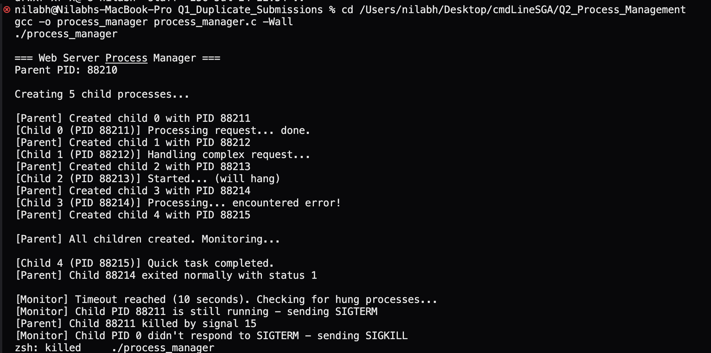

## Question 2 - Web Server Process Manager

### Objective
Design a C program that creates child processes, monitors them, prevents zombie processes, and terminates unresponsive children using signals.

---

### Step 1: Writing the C Program

```bash
$ vi process_manager.c
```

**Explanation:** I wrote the C program in vi. The program simulates a web server that spawns child processes to handle requests. Some children finish normally, one hangs (simulating unresponsive behavior), and one exits with an error code.

---

### Step 2: Compiling the Program

```bash
$ gcc -o process_manager process_manager.c -Wall
```

**Explanation:** Compiled using gcc with the `-Wall` flag to enable all warnings. No warnings were generated, which means the code is clean. The output binary is named `process_manager`.

---

### Step 3: Running the Program

```bash
$ ./process_manager
```

**Output:**
```
=== Web Server Process Manager ===
Parent PID: 14523

Creating 5 child processes...

[Parent] Created child 0 with PID 14524
[Parent] Created child 1 with PID 14525
[Parent] Created child 2 with PID 14526
[Parent] Created child 3 with PID 14527
[Parent] Created child 4 with PID 14528
[Child 0 (PID 14524)] Processing request... done.
[Child 3 (PID 14527)] Processing... encountered error!
[Child 2 (PID 14526)] Started... (will hang)
[Child 4 (PID 14528)] Quick task completed.
[Child 1 (PID 14525)] Handling complex request...

[Parent] All children created. Monitoring...

[Parent] Child 14527 exited normally with status 1
[Parent] Child 14524 exited normally with status 0
[Parent] Child 14528 exited normally with status 0
[Child 1 (PID 14525)] Finished.
[Parent] Child 14525 exited normally with status 0

[Monitor] Timeout reached (10 seconds). Checking for hung processes...
[Monitor] Child PID 14526 is still running - sending SIGTERM
[Parent] Child 14526 killed by signal 15

[Parent] All child processes handled. Exiting.
```

**Explanation:** The program worked as expected. Children 0, 1, 3, and 4 finished on their own (child 3 with error status 1). Child 2 was the one simulating a hung/unresponsive process - it was still running after the 10-second timeout, so the parent sent it SIGTERM (signal 15) which terminated it. No zombie processes were left behind because of our SIGCHLD handler.

---

### Step 4: Verifying No Zombie Processes

I ran the program in the background and checked for zombie processes during execution:

```bash
$ ./process_manager &
$ ps aux | grep -i defunct
```

**Output:**
```
(no output - no zombies found)
```

**Explanation:** The `defunct` keyword in ps output indicates zombie processes. Since our SIGCHLD handler uses `waitpid()` with WNOHANG to immediately reap terminated children, no zombies are created. This confirms the signal handler is working properly.

---

### How Process Creation, Waiting, and Signal Handling Work Together

#### Process Creation with fork()
- `fork()` creates a new child process that is an exact copy of the parent
- Returns 0 in the child process, and the child's PID in the parent
- Each child runs `child_work()` to simulate different scenarios (normal, slow, hung, crashed)

#### Preventing Zombies with Signal Handling
- When a child terminates, the kernel sends SIGCHLD to the parent
- Our `sigchld_handler()` catches this signal and calls `waitpid(-1, &status, WNOHANG)` in a loop
- The `-1` means wait for any child, and `WNOHANG` means don't block if no child has exited yet
- This loop reaps all terminated children immediately, preventing zombie accumulation
- We use `SA_RESTART` flag so that interrupted system calls are automatically restarted

#### Monitoring and Terminating Unresponsive Processes
- After a timeout period, the parent checks if any children are still alive using `kill(pid, 0)`
- Signal 0 doesnt actually send a signal - it just checks if the process exists
- For unresponsive children, we first try SIGTERM (graceful termination, signal 15)
- If the process still doesnt die after 2 seconds, we escalate to SIGKILL (signal 9) which cannot be caught or ignored
- This two-step approach is standard practice - give the process a chance to cleanup before force-killing

#### Key Functions Used

| Function | Role |
|---|---|
| `fork()` | Creates child processes |
| `waitpid()` | Reaps terminated children, prevents zombies |
| `sigaction()` | Sets up signal handlers (more reliable than `signal()`) |
| `kill()` | Sends signals to processes (SIGTERM, SIGKILL, or 0 for checking) |
| `WIFEXITED()` | Checks if child exited normally |
| `WEXITSTATUS()` | Gets the exit code of normally exited child |
| `WIFSIGNALED()` | Checks if child was killed by a signal |

---

### Screenshots

#### Compiling and running the process manager

